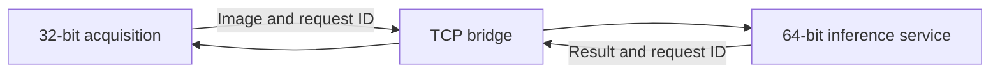

# Legacy acquisition and inference

```mermaid
flowchart LR
    A[32-bit acquisition] -->|Image and request ID| B[TCP bridge]
    B --> C[64-bit inference service]
    C -->|Result and request ID| B
    B --> A
```

The diagram summarizes the component boundary. The downloadable example runs an independent intensity-profile detector against a generated grayscale array.
